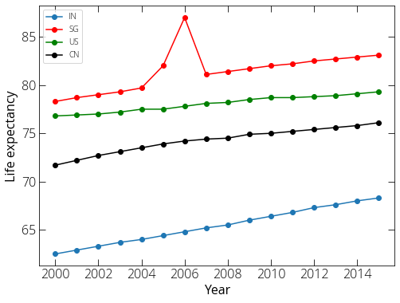
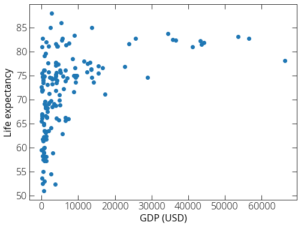
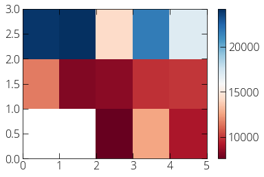

### Basic data exploration using Pandas 

We will explore life expectancy data from WHO record. You can find such datasets from [Kaggle](https://www.kaggle.com){:target="_blank"} and other databases online. You can also find a copy of the CSV file that we will be using [here](https://pranabdas.github.io/drive/downloads/datasets/Life-Expectancy-Data.csv){:target="_blank"}.

```python
import pandas as pd
```


```python
# Read the data from csv file
data = pd.read_csv("~/Desktop/Life-Expectancy-Data.csv")
```


```python
# Print the head of the data to get an overview 
data.head()
```


<div>
<style scoped>
    .dataframe tbody tr th:only-of-type {
        vertical-align: middle;
    }

    .dataframe tbody tr th {
        vertical-align: top;
    }

    .dataframe thead th {
        text-align: right;
    }
</style>
<table border="1" class="dataframe">
  <thead>
    <tr style="text-align: right;">
      <th></th>
      <th>Country</th>
      <th>Year</th>
      <th>Status</th>
      <th>Life expectancy</th>
      <th>Adult Mortality</th>
      <th>infant deaths</th>
      <th>Alcohol</th>
      <th>percentage expenditure</th>
      <th>Hepatitis B</th>
      <th>Measles</th>
      <th>...</th>
      <th>Polio</th>
      <th>Total expenditure</th>
      <th>Diphtheria</th>
      <th>HIV/AIDS</th>
      <th>GDP</th>
      <th>Population</th>
      <th>thinness  1-19 years</th>
      <th>thinness 5-9 years</th>
      <th>Income composition of resources</th>
      <th>Schooling</th>
    </tr>
  </thead>
  <tbody>
    <tr>
      <th>0</th>
      <td>Afghanistan</td>
      <td>2015</td>
      <td>Developing</td>
      <td>65.0</td>
      <td>263.0</td>
      <td>62</td>
      <td>0.01</td>
      <td>71.279624</td>
      <td>65.0</td>
      <td>1154</td>
      <td>...</td>
      <td>6.0</td>
      <td>8.16</td>
      <td>65.0</td>
      <td>0.1</td>
      <td>584.259210</td>
      <td>33736494.0</td>
      <td>17.2</td>
      <td>17.3</td>
      <td>0.479</td>
      <td>10.1</td>
    </tr>
    <tr>
      <th>1</th>
      <td>Afghanistan</td>
      <td>2014</td>
      <td>Developing</td>
      <td>59.9</td>
      <td>271.0</td>
      <td>64</td>
      <td>0.01</td>
      <td>73.523582</td>
      <td>62.0</td>
      <td>492</td>
      <td>...</td>
      <td>58.0</td>
      <td>8.18</td>
      <td>62.0</td>
      <td>0.1</td>
      <td>612.696514</td>
      <td>327582.0</td>
      <td>17.5</td>
      <td>17.5</td>
      <td>0.476</td>
      <td>10.0</td>
    </tr>
    <tr>
      <th>2</th>
      <td>Afghanistan</td>
      <td>2013</td>
      <td>Developing</td>
      <td>59.9</td>
      <td>268.0</td>
      <td>66</td>
      <td>0.01</td>
      <td>73.219243</td>
      <td>64.0</td>
      <td>430</td>
      <td>...</td>
      <td>62.0</td>
      <td>8.13</td>
      <td>64.0</td>
      <td>0.1</td>
      <td>631.744976</td>
      <td>31731688.0</td>
      <td>17.7</td>
      <td>17.7</td>
      <td>0.470</td>
      <td>9.9</td>
    </tr>
    <tr>
      <th>3</th>
      <td>Afghanistan</td>
      <td>2012</td>
      <td>Developing</td>
      <td>59.5</td>
      <td>272.0</td>
      <td>69</td>
      <td>0.01</td>
      <td>78.184215</td>
      <td>67.0</td>
      <td>2787</td>
      <td>...</td>
      <td>67.0</td>
      <td>8.52</td>
      <td>67.0</td>
      <td>0.1</td>
      <td>669.959000</td>
      <td>3696958.0</td>
      <td>17.9</td>
      <td>18.0</td>
      <td>0.463</td>
      <td>9.8</td>
    </tr>
    <tr>
      <th>4</th>
      <td>Afghanistan</td>
      <td>2011</td>
      <td>Developing</td>
      <td>59.2</td>
      <td>275.0</td>
      <td>71</td>
      <td>0.01</td>
      <td>7.097109</td>
      <td>68.0</td>
      <td>3013</td>
      <td>...</td>
      <td>68.0</td>
      <td>7.87</td>
      <td>68.0</td>
      <td>0.1</td>
      <td>63.537231</td>
      <td>2978599.0</td>
      <td>18.2</td>
      <td>18.2</td>
      <td>0.454</td>
      <td>9.5</td>
    </tr>
  </tbody>
</table>
<p>5 rows × 22 columns</p>
</div>


```python
# Let's see how many year data are there
data['Year'].unique()
```


    array([2015, 2014, 2013, 2012, 2011, 2010, 2009, 2008, 2007, 2006, 2005,
           2004, 2003, 2002, 2001, 2000])


```python
data.columns
```


    Index(['Country', 'Year', 'Status', 'Life expectancy ', 'Adult Mortality',
           'infant deaths', 'Alcohol', 'percentage expenditure', 'Hepatitis B',
           'Measles ', ' BMI ', 'under-five deaths ', 'Polio', 'Total expenditure',
           'Diphtheria ', ' HIV/AIDS', 'GDP', 'Population',
           ' thinness  1-19 years', ' thinness 5-9 years',
           'Income composition of resources', 'Schooling'],
          dtype='object')


```python
# Let us first select a subset of data (say we are interested in life expectancy)
life_expectancy = data[['Country', 'Year', 'Life expectancy ']]
```

```python
# Let's select few countries and plot the life expectancy over the years 
life_expectancy_in = life_expectancy.loc[life_expectancy['Country'] == 'India']
life_expectancy_sg = life_expectancy.loc[life_expectancy['Country'] == 'Singapore']
life_expectancy_us = life_expectancy.loc[life_expectancy['Country'] == 'United States of America']
life_expectancy_cn = life_expectancy.loc[life_expectancy['Country'] == 'China']
```

```python
# Let's plot using matplotlib 
import matplotlib.pyplot as plt
%matplotlib inline
plt.rcParams["figure.figsize"] = (8, 6)

plt.plot(life_expectancy_in['Year'], life_expectancy_in['Life expectancy '], \
         label= 'IN', marker= 'o')
plt.plot(life_expectancy_sg['Year'], life_expectancy_sg['Life expectancy '], \
         label= 'SG', marker= 'o', color='r')
plt.plot(life_expectancy_us['Year'], life_expectancy_us['Life expectancy '], \
         label= 'US', marker= 'o', color='g')
plt.plot(life_expectancy_cn['Year'], life_expectancy_cn['Life expectancy '], \
         label= 'CN', marker= 'o', color='k')
plt.xlabel('Year')
plt.ylabel('Life expectancy')
plt.legend()
plt.show()
```



```python
gdp_life_expectancy = data[['Country', 'Year', 'Life expectancy ', 'GDP']]
```

```python
gdp_life_expectancy_2015 = gdp_life_expectancy.loc[gdp_life_expectancy['Year']==2015]
```

```python
plt.scatter(gdp_life_expectancy_2015['GDP'], \
            gdp_life_expectancy_2015['Life expectancy '])
plt.xlabel('GDP (USD)')
plt.ylabel('Life expectancy')
plt.show()
```



```python
gdp_life_expectancy_2015.loc[gdp_life_expectancy_2015['Life expectancy '] > 85]
```

<div>
<style scoped>
    .dataframe tbody tr th:only-of-type {
        vertical-align: middle;
    }

    .dataframe tbody tr th {
        vertical-align: top;
    }

    .dataframe thead th {
        text-align: right;
    }
</style>
<table border="1" class="dataframe">
  <thead>
    <tr style="text-align: right;">
      <th></th>
      <th>Country</th>
      <th>Year</th>
      <th>Life expectancy</th>
      <th>GDP</th>
    </tr>
  </thead>
  <tbody>
    <tr>
      <th>737</th>
      <td>Denmark</td>
      <td>2015</td>
      <td>86.0</td>
      <td>5314.64416</td>
    </tr>
    <tr>
      <th>2345</th>
      <td>Slovenia</td>
      <td>2015</td>
      <td>88.0</td>
      <td>2729.86383</td>
    </tr>
  </tbody>
</table>
</div>

We can read data from url as well. By default, Pandas csv import assumes our data file has a header. If we do not have a header, we need to explicitly set the header to none. 

```py
import pandas as pd 
url = http://archive.ics.uci.edu/ml/machine-learning-databases/autos/imports-85.data
df = pd.read_csv(url, header = None)
``` 

We can have a look at the imported data by following methods: 
```py 
df.head()     # first 5 rows of the dataframe
df.head(10)   # first 10 rows
df.tail()     # last 5 rows 
```

Without the column headers, it is difficult to identity the columns. For our car data the headers can be found on a separate file. You can download the file and have a look into it to figure out what each column represents. Here is another way to do the same:  
```py 
import urllib
url = "http://archive.ics.uci.edu/ml/machine-learning-databases/autos/imports-85.names"
headers = {'User-Agent': 'Mozilla/5.0'}
req = urllib.request.Request(url = url, headers = headers)
data = urllib.request.urlopen(req).read().decode() 
data.split("\n")        # this is not recommended for very big dataset 
data.split("\n")[:20]   # first 20 items of the list
data.split("\n")[-20:]  # last 20 items of the list 
``` 

From above methods, we can find out the headers for our data set, and assign to our dataframe: 
```py 
headers = ["symboling", "normalized-losses", "make", "fuel-type", "aspiration",\
          "num-of-doors", "body-style", "drive-wheels", "engine-location",\
          "wheel-base", "length", "width", "height", "curb-weight", "engine-type",\
          "num-of-cylinders", "engine-size", "fuel-system", "bore", "stroke",\
          "compression-ratio", "horsepower", "peak-rpm", "city-mpg", "highway-mpg",\
          "price"]
df.columns = headers
df.head()
```

Renaming a column:
```py 
df["city-mpg"] = 235/df["city-mpg"]
df.rename(columns={"city_mpg" : "city-L/100km"}, inplace=True)
```

We can save our data with the headers: 
```py
df.to_csv("/Users/Pranab/Desktop/car_data.csv", index=None)
``` 

There are few other common formats: 

| Format  | Read            | Save          |
| :------ | :-------------- | :------------ |
| csv     | pd.read_csv()   | df.to_csv()   |
| json    | pd.read_json()  | df.to_json()  |
| excel   | pd.read_excel() | df.to_excel() |
| sql     | pd.read_sql()   | df.to_sql()   |


**Data types in Pandas:** 
```py
df.dtypes
``` 

The default pandas data import may not assign the correct data type. In that case we need to convert correct data type manually. But, before we do that we may need to do some cleanup. We will see that many of entries in our data is missing or not available. For example, many entries in our car data is "?". Many of the python functions and methods will result in error if we proceed with such entries. In the first attempt, we many replace the "?" by "NaN". 
```py 
df.replace("?", "NaN", inplace=True) 
df["price"] = df["price"].astype("float")
df.dtypes
```

And we will see that we have correctly applied float type to our price column. Now let's have a overview of our dataset: 
```py 
df.describe()
```

If we want to see some basis statistics on Object columns as well: 
```py 
df.describe(include="all")
```

Following method can also be helpful:
```py 
df.info()
```

**Strategy for missing data:** 

- Drop the row if there is a missing value. 
- Replace/insert values for missing value. Inserting average of the whole dataset. If the datatype is categorical, we can replace by the most occurring data entry. 

Drop missing values using **dropna** method: 
```py 
df.dropna(subset=["price"], axis=0, inplace=True)
```
`axis=1` for dropping column. 

We can replace the missing values if appropriate: 
```py
import numpy as np
df["horsepower"] = df["horsepower"].astype("float")
mean = df["horsepower"].mean()
df["horsepower"].replace(np.nan, mean, inplace=True)
```

**Data normalization:** 

When we work with different kind of data say car price and horse power, the prices are ranged from 5,000 - 50,000 USD while horse power maybe 20 to 200. If we use these two features to build a model, the price will influence the model more because of its higher values. In such cases we may need to normalize both data in similar ranges. Say we normalize both the columns in the range [0, 1]. 
```py 
# simple scaling 
df["price"] = df["price"]/df["price"].max()

# min-max
df["price"] = (df["price"] - df["price"].mean())/(df["price"].max() - df["price"].min())

# z-score 
df["price"] = (df["price"] - df["price"].mean())/df["price"].std()
```

**Data binning:** 

Say we want to categorize our price in to low, medium, and high price cars: 

```py
bins = np.linspace(df["price"].min(), df["price"].max(), 4)
categories = ["low", "medium", "high"]
df["price-binned"] = pd.cut(df["price"], bins, labels=categories, include_lowest=True)
```

#### More methods for data exploration 

**value_counts():** 

```py 
drive_wheels_counts = df["drive-wheels"].value_counts()
drive_wheels_counts 
```

**Groupby():** 

```py
df_copy = df[["drive-wheels", "body-style", "price"]]
df_grp = df_copy.groupby(["drive-wheels"], as_index=False).mean()
df_grp
```

We can groupby() using multiple variables: 
```py 
df_grp = df_copy.groupby(["drive-wheels", "body-style"], as_index=False).mean()
df_grp
```

**Pivot() table:** 

```py
df_pivot = df_grp.pivot(index="drive-wheels", columns="body-style")
df_pivot
```

**Heatmap:** 

```py
import matplotlib.pyplot as plt
%matplotlib inline

plt.pcolor(df_pivot, cmap="RdBu")
plt.colorbar()
plt.show()
```

 

**Analysis of Variance (ANOVA):** 

```py 
df_copy = df[["make", "price"]]
df_grp = df_copy.groupby(["make"])

from scipy import stats

anova_honda_subaru = stats.f_oneway(df_grp.get_group("honda")["price"], \
                                    df_grp.get_group("subaru")["price"])
print(anova_honda_subaru)
```

Output:
```
F_onewayResult(statistic=0.19744030127462606, pvalue=0.6609478240622193)
```

Similarly: 
```py 
anova_honda_jaguar = stats.f_oneway(df_grp.get_group("honda")["price"], \
                                    df_grp.get_group("jaguar")["price"])
print(anova_honda_jaguar)
```

Output: 
```
F_onewayResult(statistic=400.925870564337, pvalue=1.0586193512077862e-11)
```

**Pearson Correlation coefficient:** 

```py 
p_coef, p_val = stats.pearsonr(df["horsepower"], df["price"]) 
print (p_coef, p_val)
```

Output: 
```
0.8096811975632288 6.058444649710002e-48
```

- Pearson correlation coefficient +1 : positive correlation 
- Pearson correlation coefficient -1 : negative correlation 
- Pearson correlation coefficient 0 : no correlation 
- Pvalue < 0.001 : strong certainty 
- Pvalue > 0.1 : no certainty 

We can create correlation heatmaps between various parameters. 
