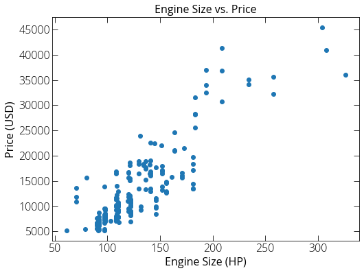
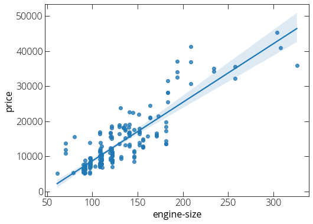

### Linear regression 

Here we will use a data set of used car prices. The data was downloaded from [http://archive.ics.uci.edu/ml/machine-learning-databases/autos/imports-85.data](http://archive.ics.uci.edu/ml/machine-learning-databases/autos/imports-85.data){:target="_blank"}. You can find a copy [here](https://pranabdas.github.io/drive/downloads/datasets/car-price.csv){:target="_blank"} as well. 

```python
import pandas as pd
import numpy as np 
import matplotlib.pyplot as plt
%matplotlib inline
plt.rcParams["figure.figsize"] = (8, 6)
```


```python
# First load our data
data = pd.read_csv("~/Desktop/car-price.csv")
```


```python
# Let's have a look with head()
data.head()
```


<div>
<style scoped>
    .dataframe tbody tr th:only-of-type {
        vertical-align: middle;
    }

    .dataframe tbody tr th {
        vertical-align: top;
    }

    .dataframe thead th {
        text-align: right;
    }
</style>
<table border="1" class="dataframe">
  <thead>
    <tr style="text-align: right;">
      <th></th>
      <th>Unnamed: 0</th>
      <th>symboling</th>
      <th>normalized-losses</th>
      <th>make</th>
      <th>fuel-type</th>
      <th>aspiration</th>
      <th>num-of-doors</th>
      <th>body-style</th>
      <th>drive-wheel</th>
      <th>engine-location</th>
      <th>...</th>
      <th>engine-size</th>
      <th>fuel-system</th>
      <th>bore</th>
      <th>stroke</th>
      <th>compression-ratio</th>
      <th>horsepower</th>
      <th>peak-rpm</th>
      <th>city-mpg</th>
      <th>highway-mpg</th>
      <th>price</th>
    </tr>
  </thead>
  <tbody>
    <tr>
      <th>0</th>
      <td>0</td>
      <td>3</td>
      <td>?</td>
      <td>alfa-romero</td>
      <td>gas</td>
      <td>std</td>
      <td>two</td>
      <td>convertible</td>
      <td>rwd</td>
      <td>front</td>
      <td>...</td>
      <td>130</td>
      <td>mpfi</td>
      <td>3.47</td>
      <td>2.68</td>
      <td>9.0</td>
      <td>111</td>
      <td>5000</td>
      <td>21</td>
      <td>27</td>
      <td>13495</td>
    </tr>
    <tr>
      <th>1</th>
      <td>1</td>
      <td>3</td>
      <td>?</td>
      <td>alfa-romero</td>
      <td>gas</td>
      <td>std</td>
      <td>two</td>
      <td>convertible</td>
      <td>rwd</td>
      <td>front</td>
      <td>...</td>
      <td>130</td>
      <td>mpfi</td>
      <td>3.47</td>
      <td>2.68</td>
      <td>9.0</td>
      <td>111</td>
      <td>5000</td>
      <td>21</td>
      <td>27</td>
      <td>16500</td>
    </tr>
    <tr>
      <th>2</th>
      <td>2</td>
      <td>1</td>
      <td>?</td>
      <td>alfa-romero</td>
      <td>gas</td>
      <td>std</td>
      <td>two</td>
      <td>hatchback</td>
      <td>rwd</td>
      <td>front</td>
      <td>...</td>
      <td>152</td>
      <td>mpfi</td>
      <td>2.68</td>
      <td>3.47</td>
      <td>9.0</td>
      <td>154</td>
      <td>5000</td>
      <td>19</td>
      <td>26</td>
      <td>16500</td>
    </tr>
    <tr>
      <th>3</th>
      <td>3</td>
      <td>2</td>
      <td>164</td>
      <td>audi</td>
      <td>gas</td>
      <td>std</td>
      <td>four</td>
      <td>sedan</td>
      <td>fwd</td>
      <td>front</td>
      <td>...</td>
      <td>109</td>
      <td>mpfi</td>
      <td>3.19</td>
      <td>3.40</td>
      <td>10.0</td>
      <td>102</td>
      <td>5500</td>
      <td>24</td>
      <td>30</td>
      <td>13950</td>
    </tr>
    <tr>
      <th>4</th>
      <td>4</td>
      <td>2</td>
      <td>164</td>
      <td>audi</td>
      <td>gas</td>
      <td>std</td>
      <td>four</td>
      <td>sedan</td>
      <td>4wd</td>
      <td>front</td>
      <td>...</td>
      <td>136</td>
      <td>mpfi</td>
      <td>3.19</td>
      <td>3.40</td>
      <td>8.0</td>
      <td>115</td>
      <td>5500</td>
      <td>18</td>
      <td>22</td>
      <td>17450</td>
    </tr>
  </tbody>
</table>
<p>5 rows × 27 columns</p>
</div>


```python
# Replace the ? marks with NaN
data.replace("?", "NaN", inplace=True)
```


```python
data.head()
```


<div>
<style scoped>
    .dataframe tbody tr th:only-of-type {
        vertical-align: middle;
    }

    .dataframe tbody tr th {
        vertical-align: top;
    }

    .dataframe thead th {
        text-align: right;
    }
</style>
<table border="1" class="dataframe">
  <thead>
    <tr style="text-align: right;">
      <th></th>
      <th>Unnamed: 0</th>
      <th>symboling</th>
      <th>normalized-losses</th>
      <th>make</th>
      <th>fuel-type</th>
      <th>aspiration</th>
      <th>num-of-doors</th>
      <th>body-style</th>
      <th>drive-wheel</th>
      <th>engine-location</th>
      <th>...</th>
      <th>engine-size</th>
      <th>fuel-system</th>
      <th>bore</th>
      <th>stroke</th>
      <th>compression-ratio</th>
      <th>horsepower</th>
      <th>peak-rpm</th>
      <th>city-mpg</th>
      <th>highway-mpg</th>
      <th>price</th>
    </tr>
  </thead>
  <tbody>
    <tr>
      <th>0</th>
      <td>0</td>
      <td>3</td>
      <td>NaN</td>
      <td>alfa-romero</td>
      <td>gas</td>
      <td>std</td>
      <td>two</td>
      <td>convertible</td>
      <td>rwd</td>
      <td>front</td>
      <td>...</td>
      <td>130</td>
      <td>mpfi</td>
      <td>3.47</td>
      <td>2.68</td>
      <td>9.0</td>
      <td>111</td>
      <td>5000</td>
      <td>21</td>
      <td>27</td>
      <td>13495</td>
    </tr>
    <tr>
      <th>1</th>
      <td>1</td>
      <td>3</td>
      <td>NaN</td>
      <td>alfa-romero</td>
      <td>gas</td>
      <td>std</td>
      <td>two</td>
      <td>convertible</td>
      <td>rwd</td>
      <td>front</td>
      <td>...</td>
      <td>130</td>
      <td>mpfi</td>
      <td>3.47</td>
      <td>2.68</td>
      <td>9.0</td>
      <td>111</td>
      <td>5000</td>
      <td>21</td>
      <td>27</td>
      <td>16500</td>
    </tr>
    <tr>
      <th>2</th>
      <td>2</td>
      <td>1</td>
      <td>NaN</td>
      <td>alfa-romero</td>
      <td>gas</td>
      <td>std</td>
      <td>two</td>
      <td>hatchback</td>
      <td>rwd</td>
      <td>front</td>
      <td>...</td>
      <td>152</td>
      <td>mpfi</td>
      <td>2.68</td>
      <td>3.47</td>
      <td>9.0</td>
      <td>154</td>
      <td>5000</td>
      <td>19</td>
      <td>26</td>
      <td>16500</td>
    </tr>
    <tr>
      <th>3</th>
      <td>3</td>
      <td>2</td>
      <td>164</td>
      <td>audi</td>
      <td>gas</td>
      <td>std</td>
      <td>four</td>
      <td>sedan</td>
      <td>fwd</td>
      <td>front</td>
      <td>...</td>
      <td>109</td>
      <td>mpfi</td>
      <td>3.19</td>
      <td>3.40</td>
      <td>10.0</td>
      <td>102</td>
      <td>5500</td>
      <td>24</td>
      <td>30</td>
      <td>13950</td>
    </tr>
    <tr>
      <th>4</th>
      <td>4</td>
      <td>2</td>
      <td>164</td>
      <td>audi</td>
      <td>gas</td>
      <td>std</td>
      <td>four</td>
      <td>sedan</td>
      <td>4wd</td>
      <td>front</td>
      <td>...</td>
      <td>136</td>
      <td>mpfi</td>
      <td>3.19</td>
      <td>3.40</td>
      <td>8.0</td>
      <td>115</td>
      <td>5500</td>
      <td>18</td>
      <td>22</td>
      <td>17450</td>
    </tr>
  </tbody>
</table>
<p>5 rows × 27 columns</p>
</div>


```python
# Get some basic statistical description 
data.describe()
```


<div>
<style scoped>
    .dataframe tbody tr th:only-of-type {
        vertical-align: middle;
    }

    .dataframe tbody tr th {
        vertical-align: top;
    }

    .dataframe thead th {
        text-align: right;
    }
</style>
<table border="1" class="dataframe">
  <thead>
    <tr style="text-align: right;">
      <th></th>
      <th>Unnamed: 0</th>
      <th>symboling</th>
      <th>wheel-base</th>
      <th>length</th>
      <th>width</th>
      <th>height</th>
      <th>curb-weight</th>
      <th>engine-size</th>
      <th>compression-ratio</th>
      <th>city-mpg</th>
      <th>highway-mpg</th>
    </tr>
  </thead>
  <tbody>
    <tr>
      <th>count</th>
      <td>205.000000</td>
      <td>205.000000</td>
      <td>205.000000</td>
      <td>205.000000</td>
      <td>205.000000</td>
      <td>205.000000</td>
      <td>205.000000</td>
      <td>205.000000</td>
      <td>205.000000</td>
      <td>205.000000</td>
      <td>205.000000</td>
    </tr>
    <tr>
      <th>mean</th>
      <td>102.000000</td>
      <td>0.834146</td>
      <td>98.756585</td>
      <td>174.049268</td>
      <td>65.907805</td>
      <td>53.724878</td>
      <td>2555.565854</td>
      <td>126.907317</td>
      <td>10.142537</td>
      <td>25.219512</td>
      <td>30.751220</td>
    </tr>
    <tr>
      <th>std</th>
      <td>59.322565</td>
      <td>1.245307</td>
      <td>6.021776</td>
      <td>12.337289</td>
      <td>2.145204</td>
      <td>2.443522</td>
      <td>520.680204</td>
      <td>41.642693</td>
      <td>3.972040</td>
      <td>6.542142</td>
      <td>6.886443</td>
    </tr>
    <tr>
      <th>min</th>
      <td>0.000000</td>
      <td>-2.000000</td>
      <td>86.600000</td>
      <td>141.100000</td>
      <td>60.300000</td>
      <td>47.800000</td>
      <td>1488.000000</td>
      <td>61.000000</td>
      <td>7.000000</td>
      <td>13.000000</td>
      <td>16.000000</td>
    </tr>
    <tr>
      <th>25%</th>
      <td>51.000000</td>
      <td>0.000000</td>
      <td>94.500000</td>
      <td>166.300000</td>
      <td>64.100000</td>
      <td>52.000000</td>
      <td>2145.000000</td>
      <td>97.000000</td>
      <td>8.600000</td>
      <td>19.000000</td>
      <td>25.000000</td>
    </tr>
    <tr>
      <th>50%</th>
      <td>102.000000</td>
      <td>1.000000</td>
      <td>97.000000</td>
      <td>173.200000</td>
      <td>65.500000</td>
      <td>54.100000</td>
      <td>2414.000000</td>
      <td>120.000000</td>
      <td>9.000000</td>
      <td>24.000000</td>
      <td>30.000000</td>
    </tr>
    <tr>
      <th>75%</th>
      <td>153.000000</td>
      <td>2.000000</td>
      <td>102.400000</td>
      <td>183.100000</td>
      <td>66.900000</td>
      <td>55.500000</td>
      <td>2935.000000</td>
      <td>141.000000</td>
      <td>9.400000</td>
      <td>30.000000</td>
      <td>34.000000</td>
    </tr>
    <tr>
      <th>max</th>
      <td>204.000000</td>
      <td>3.000000</td>
      <td>120.900000</td>
      <td>208.100000</td>
      <td>72.300000</td>
      <td>59.800000</td>
      <td>4066.000000</td>
      <td>326.000000</td>
      <td>23.000000</td>
      <td>49.000000</td>
      <td>54.000000</td>
    </tr>
  </tbody>
</table>
</div>


```python
data.info()
```

    <class 'pandas.core.frame.DataFrame'>
    RangeIndex: 205 entries, 0 to 204
    Data columns (total 27 columns):
     #   Column             Non-Null Count  Dtype  
    ---  ------             --------------  -----  
     0   Unnamed: 0         205 non-null    int64  
     1   symboling          205 non-null    int64  
     2   normalized-losses  205 non-null    object 
     3   make               205 non-null    object 
     4   fuel-type          205 non-null    object 
     5   aspiration         205 non-null    object 
     6   num-of-doors       205 non-null    object 
     7   body-style         205 non-null    object 
     8   drive-wheel        205 non-null    object 
     9   engine-location    205 non-null    object 
     10  wheel-base         205 non-null    float64
     11  length             205 non-null    float64
     12  width              205 non-null    float64
     13  height             205 non-null    float64
     14  curb-weight        205 non-null    int64  
     15  engine-type        205 non-null    object 
     16  num-of-cylinder    205 non-null    object 
     17  engine-size        205 non-null    int64  
     18  fuel-system        205 non-null    object 
     19  bore               205 non-null    object 
     20  stroke             205 non-null    object 
     21  compression-ratio  205 non-null    float64
     22  horsepower         205 non-null    object 
     23  peak-rpm           205 non-null    object 
     24  city-mpg           205 non-null    int64  
     25  highway-mpg        205 non-null    int64  
     26  price              205 non-null    object 
    dtypes: float64(5), int64(6), object(16)
    memory usage: 43.4+ KB


```python
# Some data are set as object while importing. we can fix that. 
data["price"] = data["price"].astype("float")
```


```python
data['price'].head()
```


    0    13495.0
    1    16500.0
    2    16500.0
    3    13950.0
    4    17450.0
    Name: price, dtype: float64


```python
# Let's plot engine-size vs. price 

plt.scatter(data['engine-size'], data['price'])
plt.title("Engine Size vs. Price")
plt.xlabel("Engine Size (HP)") 
plt.ylabel("Price (USD)")
plt.show()
```





```python
# Regplot using seaborn
import seaborn as sns 

sns.regplot(x="engine-size", y="price", data=data)
plt.show()
```





```python
from sklearn.linear_model import LinearRegression 

# Linear Regression does not work with NaN data points 
data_copy = data.dropna(subset=["engine-size"], axis=0)
data_copy = data_copy.dropna(subset=["price"], axis=0)

lm = LinearRegression()
X = data_copy["engine-size"] 
Y = data_copy["price"] 
lm.fit(X, Y)

print(lm.intercept_, lm.coef_)
```

    -7963.338906281042 [166.86001569]


```python
# Correlation 
import scipy.stats as stats 

pearson_coef, p_values = stats.pearsonr(data_copy["engine-size"], data_copy["price"])
print(pearson_coef, p_values)
```

    0.8723351674455185 9.265491622198389e-64
