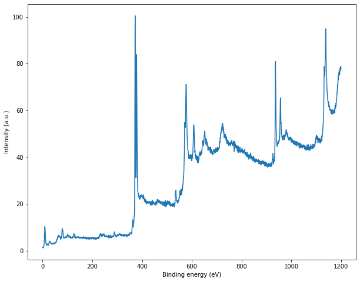
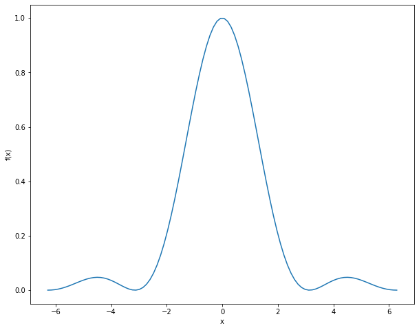

### File read and write 

Being able to read data from files and write the data generated by your program is an essential part of programming. 

Here we will open a file called *xps-data.txt* which is stored in our current directory. You can obtain the same data file from my [GitHub](https://github.com/pranabdas/python-learning/) (check inside the *Notebooks*) and put it in your current directory. In case, you want to open file from another directory, you just need to provide the absolute or relative path of the file instead of just file name. 

Our data file contains two columns of numbers; energy and intensity. We can read/extract the data following way: 
```py 
# create two lists to store our energy and intensity values 
energy = []
intensity = []

fid = open('xps-data.txt', 'r');
# read one line at a time 
data = fid.readlines(); 
fid.close(); 

# number of lines we have 
lines = len(data); 
for lines in range(lines):
    data_row = data[lines]; 
    
    # remove the last newline character from each line 
    data_row = data_row[:-1]; 
    
    # split in the tab character to separate energy and intensity strings
    data_row = data_row.split('\t')
    
    # store them in our energy and intensity variables as float
    energy.append(float(data_row[0]));
    intensity.append(float(data_row[1]));
```

Now that our data is stored in the energy and intensity variables, we can check them by index:
```py 
>>> energy[0]

1200.0

>>> intensity[5]

78.8658
``` 

But the best way to visualize our data is to make a plot. We will use [matplotlib](../matplotlib/matplotlib.md) to do that: 
```py 
import matplotlib.pyplot as plt
%matplotlib inline 

plt.figure(figsize = (10, 8))
plt.plot(energy, intensity)
plt.xlabel('Kinetic energy (eV)')
plt.ylabel('Intensity (a.u.)')
plt.show()
``` 
 

Now that we are able to read data from a file, and use in our program, let us try to generate and save some data. 
```py 
import numpy as np 
x = np.linspace(-2*np.pi, 2*np.pi, num = 100); 
y = (np.sin(x)/x)**2;

plt.figure(figsize = (10, 8))
plt.plot(x, y)
plt.xlabel('x')
plt.ylabel('f(x)')
plt.show()
```
 

We can save the data as follows: 
```py 
fid = open('data.txt', 'w'); 

for index in range(len(x)): 
    fid.write('{0}\t{1}\n'.format(x[index], y[index]));
fid.close(); 
```
We have stored our data in a file named *data.txt*. 
