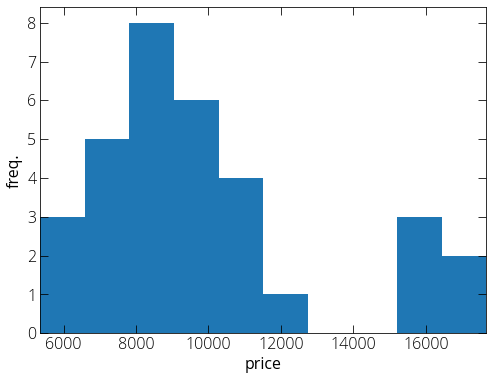
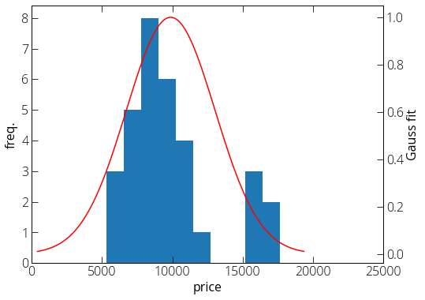
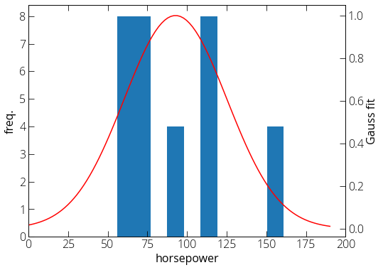
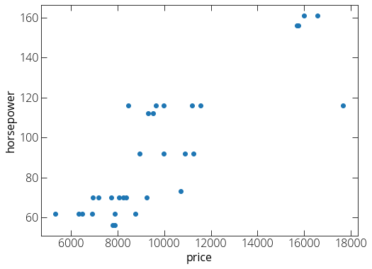

### Generative (Naive Bayes) model for classification 

Here we fit each class (independently) with a model. Say we have two classes with one dimensional probability distributions $P_1(x)$ and $P_2(x)$. 

Let's say our training set has $\pi_1$ fraction of class one and $\pi_2$ fraction of class two. $\pi_1 + \pi_2 = 1$. 

Now for a new point (x), we predict its class for which $\pi_iP_i(x)$ is maximum. Note that $\pi_i$ is determined based on our training dataset. 

Further reading : [https://scikit-learn.org/stable/modules/naive_bayes.html](https://scikit-learn.org/stable/modules/naive_bayes.html){:target="_blank"}

Let us try to look at it with a practical dataset. I am going to use car price dataset that we used in our [linear regression example](../data-science/linear-regression.md). 

You may download a copy of the data: 
```
wget https://pranabdas.github.io/drive/downloads/datasets/car-price.csv
```

First load the data using pandas: 
```py
import pandas as pd
data = pd.read_csv("~/Desktop/car-price.csv")

# Replace the ? marks with NaN
data.replace("?", "NaN", inplace=True)

# Some data are set as object while importing. we can fix that. 
data["price"] = data["price"].astype("float")
data["horsepower"] = data["horsepower"].astype("float")

# Remove the rows with NaN values in price and horsepower col
data = data.dropna(subset=['price', 'horsepower']) 

# How many unique car models do we have? 
data['make'].unique()
```

First step, we try to classify the make/model of the car looking at only at one variable, say price. How does the price distribution looks for a given model? 

```py
import matplotlib.pyplot as plt
import numpy as np
%matplotlib inline
plt.rcParams["figure.figsize"] = (8, 6)

# Select Toyota cars only
data_copy = data.loc[data['make'] == 'toyota']

plt.hist(data_copy["price"], 10)
plt.xlim(min(data_copy["price"]), max(data_copy["price"]))
plt.xlabel("price")
plt.ylabel("freq.")
plt.show()
```


The sample size looks very small, still let's try to fit the distribution with Gaussian distribution. 
```py
from scipy.stats import norm
mu = np.mean(data_copy['price'])
var = np.var(data_copy['price'])
std = np.sqrt(var)

fig, ax1 = plt.subplots()
ax2 = ax1.twinx()
ax1.hist(data_copy["price"], 10)
plt.xlim(0, 25000)
ax1.set_ylabel("freq.")
ax1.set_xlabel("price")

price_axis = np.linspace(mu - 3*std, mu + 3*std, 100)
ax2.plot(price_axis, norm.pdf(price_axis,mu,std)/\
         max(norm.pdf(price_axis,mu,std)), 'r')
ax2.set_ylabel("Gauss fit")
plt.show()
```


Here $\pi_{toyota}$ is (number of toyota cars)/(total number of cars in our test set), and $P_{toyota}(price)$ is given by our Gaussian distribution. 


#### Generative model in two-dimension 

Instead of only one variable, we can use another variable (say engine size) in our model. In this case, we can fit the data to a two dimensional Gaussian. The relevant parameters are: means $(\mu_1, \mu_2)$, and covariance matrix: 

$\Sigma = 
\begin{bmatrix}
var(x_1) && cov(x_1 x_2) \\
cov(x_2 x_1) && var(x_2)
\end{bmatrix}$ 

It's a symmetric matrix as off-diagonal terms $\Sigma_{12} = \Sigma_{21}$. The form of the distribution: 

$$ P(x_1, x_2) = \frac{1}{2 \pi |\Sigma|^{1/2}} \exp \left[-\frac{1}{2} \begin{pmatrix} x_1 - \mu_1 \\ x_2 - \mu_2 \end{pmatrix}^T \Sigma^{-1} \begin{pmatrix} x_1 - \mu_1 \\ x_2 - \mu_2 \end{pmatrix} \right] $$ 

If two variables ($x_1$ and $x_2$) are independent, the elliptic contour of two dimensional Gaussian would be axis-aligned. 

Now in our car price data, let us consider another variable horsepower along with the price. Here is the distribution of horsepower for Toyota cars. 

```py
from scipy.stats import norm
mu = np.mean(data_copy['horsepower'])
var = np.var(data_copy['horsepower'])
std = np.sqrt(var)

fig, ax1 = plt.subplots()
ax2 = ax1.twinx()
ax1.hist(data_copy["horsepower"], 10)
plt.xlim(0, 200)
ax1.set_ylabel("freq.")
ax1.set_xlabel("horsepower")

horsepower_axis = np.linspace(mu - 3*std, mu + 3*std, 100)
ax2.plot(horsepower_axis, norm.pdf(horsepower_axis,mu,std)/\
         max(norm.pdf(horsepower_axis,mu,std)), 'r')
ax2.set_ylabel("Gauss fit")
plt.show()
```

 

So how does the price vs. horsepower relation looks like? 

 

We can see there is a positive correlation. Now we can find out the relevant parameters: 
```py
>>> mu1 = np.mean(data_copy['price']); mu1
9885.8125

>>> mu2 = np.mean(data_copy['horsepower']); mu2
92.78125

>>> cov_car = np.cov([data_copy['price'], data_copy['horsepower']]); cov_car
array([[1.02719104e+07, 8.97956351e+04],
       [8.97956351e+04, 1.08682157e+03]])
``` 
