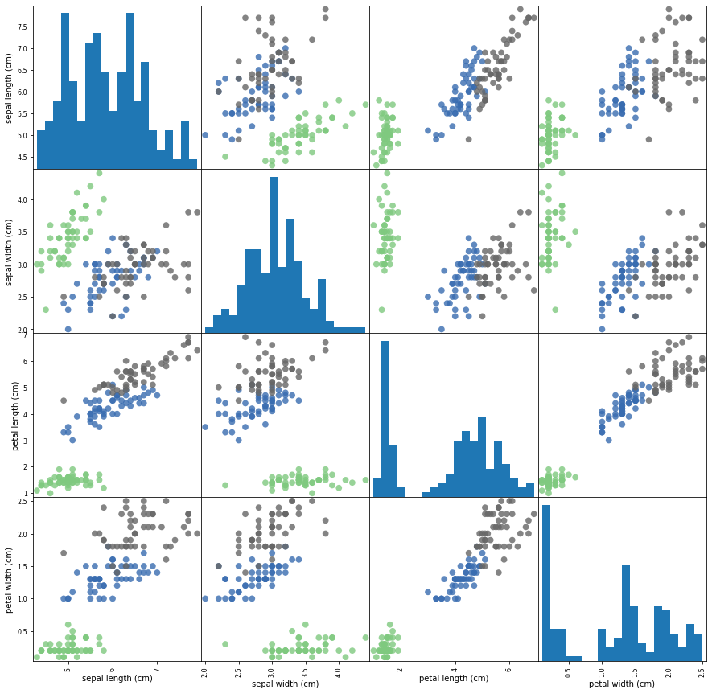

### K-Nearest Neighbors (KNN)

K represents the number of nearest neighbors. If K=1, it becomes nearest neighbor algorithm. The distance in KNN could be chosen among Euclidean, Hamming, Manhattan, Minkowski etc. 

KNN performs better with a low number of features. We need to perform principal component analysis or feature selection before applying KNN. Increase in dimension requires exponential increase in data points. 

Here we will use the Iris flower species dataset to classify various Iris flowers based on the features like petal length, petal width, sepal length and sepal width. 

```py 
from sklearn.datasets import load_iris
from sklearn.model_selection import train_test_split
from sklearn.neighbors import KNeighborsClassifier
import numpy as np
import pandas as pd
import matplotlib.pyplot as plt
import seaborn as sns

%matplotlib inline

# Import Iris dataset from scikit learn
data = load_iris()
```

```py 
# explore the data
dir(data)

['DESCR',
 'data',
 'feature_names',
 'filename',
 'frame',
 'target',
 'target_names']
```

```py 
# both dot notation or dictionary key can be used to access the data
data['feature_names']

['sepal length (cm)',
 'sepal width (cm)',
 'petal length (cm)',
 'petal width (cm)']

data.target_names

array(['setosa', 'versicolor', 'virginica'], dtype='<U10')
```

Matrix plot to get an overall idea/ relation among various features:
```py 
df = pd.DataFrame(data.data, columns=data.feature_names)
pd.plotting.scatter_matrix(df, c=data.target, figsize=(15, 15), marker='o',\
                 hist_kwds={'bins': 20}, s=60, alpha=.8, cmap='Accent')
plt.show()
```

 

**Train-test split:**

```py 
X_train, X_test, y_train, y_test = train_test_split(data['data'], \
                                   data['target'], random_state=0)
knn = KNeighborsClassifier(n_neighbors=1)
knn.fit(X_train, y_train)
knn.predict(X_test[0].reshape(1, -1))[0]
```
2

```py 
y_test[0]
```
2

```py 
y_pred = knn.predict(X_test)
np.mean(y_pred == y_test)
```
0.9736842105263158

```py 
knn.score(X_test, y_test)
```
0.9736842105263158
