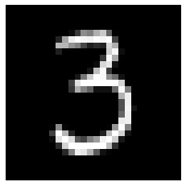
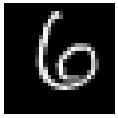
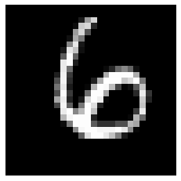

### Nearest neighbor classification 

In order to find the nearest neighbors, we need the notion of distance. We are familiar with the simple case of points in a two dimensional Euclidean plane, we may consider the Euclidean distance $\sqrt{(x_2 - x_1)^2 + (y_2 - y_1)^2}$ to find the nearest neighbors. This idea can be extended to higher dimensions, and to quantities beyond spatial coordinates. Our distance function can be other than Euclidean distance. We can apply nearest neighbor algorithm to recognize handwritten digits. How do we treat an image data and find its distance from another image? One idea could be to convert image data to an one dimensional vector. Suppose all our images are MxN pixels. We first convert the images to one dimensional vectors; we can just put the first row first, then second row and so on. The length of each vector is M*N. Now each pixel contains gray-scale intensity values [0, 255]. Now we can simply find the Euclidean distance between two images: 

$|d|_2 = \sqrt{\sum_1^{M*N} (x_i - z_i)^2}$

Is Euclidean distance correct choice in this case? Certainly not so obvious, and it depends on the nature of the problem. Are there other distance functions that can give us more accurate predictions? There are several other distance functions that can be appropriate depending on the type of problem. Euclidean distance is a subset of broader class of $L_p$ distances: 

$$  |d|_p = \large(\sum_i |(x_i - z_i)|^p\large)^{1/p} $$ 

$L_{\infty}$ is defined as: $|x-z|_{\infty} = max_i |x_i - z_i|$ 

It is non-parametric method, and often suitable for problems where the decision boundary is irregular. However, note that we can choose the number of neighbors and the appropriate distance function. 

**Resources:** The MNIST database of handwritten digits - [http://yann.lecun.com/exdb/mnist/](http://yann.lecun.com/exdb/mnist/){:target="_blank"}

In the MNIST dataset there are 60,000 images of handwritten digits with correct labels, which can be used as training set. There are also additional 10,000 images for test set. 

In the nearest neighbor classification, we decide the correct digit for a given image, by comparing the distance of given image with 60,000 training dataset, and choosing the closest image with its label. 

```py 
import io, gzip 
from urllib.request import urlopen
import numpy as np
import matplotlib.pyplot as plt 

%matplotlib inline
```

```py
# load images
def mnist_images(url):  
    with gzip.open(io.BytesIO(urlopen(url).read()), 'rb') as f:
        data = np.frombuffer(f.read(), np.uint8, offset=16)
        # consult <http://yann.lecun.com/exdb/mnist/> for details 
    data = data.reshape(-1,784)
    return data/256  # we are using int8, squared distance could be large

# load image labels
def mnist_labels(url):        
    with gzip.open(io.BytesIO(urlopen(url).read()), 'rb') as f:
        data = np.frombuffer(f.read(), np.uint8, offset=8)
    return data

# plot/view a specific image
def mnist_view(im):
    plt.axis('off')
    plt.imshow(im.reshape((28,28)), cmap=plt.cm.gray, origin='upper')
    plt.show()
    return

# calculate squared distance
def dist(x1, x2):
    return np.sum(np.square(x1-x2))

# find nearest neighbor 
def find_nn(x):
    dist_vec = [dist(x, train_data[i,]) for i in range(len(train_labels))]
    print("Index: ", np.argmin(dist_vec))
    return train_labels[np.argmin(dist_vec)]
```

```py
train_data = mnist_images('https://pranabdas.github.io/drive/datasets/mnist-handwritten-digits/train-images-idx3-ubyte.gz')
test_data = mnist_images('https://pranabdas.github.io/drive/datasets/mnist-handwritten-digits/t10k-images-idx3-ubyte.gz')
train_labels = mnist_labels('https://pranabdas.github.io/drive/datasets/mnist-handwritten-digits/train-labels-idx1-ubyte.gz')
test_labels = mnist_labels('https://pranabdas.github.io/drive/datasets/mnist-handwritten-digits/t10k-labels-idx1-ubyte.gz')
```

```py
# view a sample data
mnist_view(train_data[50,:]);
```
 

```py
# print the corresponding label 
print("Label:", train_labels[50])
```
Label: 3

```py
find_nn(test_data[100, :])
```
Index:  57158  
6

```py
mnist_view(test_data[100, :])
```
 

```py
mnist_view(train_data[57158, ])
```
 

The nearest neighbor algorithm can be imported from the `scikit-learn` `KDTree` and `BallTree` algorithm, where the search is faster than our above algorithm: 
```py 
from sklearn.neighbors import BallTree, KDTree

ball_tree = BallTree(train_data)
kd_tree = KDTree(train_data)
```
```py
train_labels[ball_tree.query(test_data[100, :].reshape(1, -1), \
                             k=1, return_distance=False)[0][0]]
```
6
```py
train_labels[kd_tree.query(test_data[100, :].reshape(1, -1), k=1, \
                           return_distance=False)[0][0]]
```
6 

```py 
# Let's calculate the precision of nearest neighbor algorithm
result = [train_labels[ball_tree.query(test_data[i, :].reshape(1, -1), k=1, \
         return_distance=False)[0][0]] for i in range(len(test_labels))]

correct_result = np.equal(result, test_labels)
success = float(np.sum(correct_result))/len(test_labels)
print('Success =', success*100, '%')
```
Success = 96.91 %
