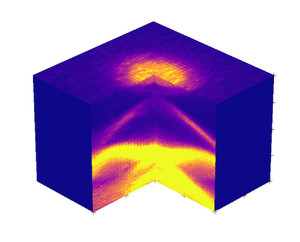
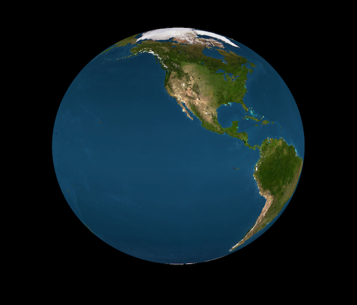

### Advanced 3D plots 

```py
import numpy as np
import matplotlib.image as image
import matplotlib.pyplot as plt
import matplotlib.cm as cm
import sys
sys.path.append("/Users/Pranab/Documents/github/")
import arpespythontools as arp
%matplotlib inline


# Get your data 
FS, x, y = arp.import_itx('data/MAP_2pt_19_k_FS.itx')
GX, x, y = arp.import_itx('data/MAP_2pt_19_k_horiz.itx')
GY, x, y = arp.import_itx('data/MAP_2pt_19_k_vert.itx')

# Extract the surfaces 
FS_back = FS[158:494, 27:47]
FS_front = FS[158:325, 5:26]
GX = GX[98:298, 326:494].T
GY = GY[98:298, 5:26].T

xp, yp = FS_back.shape
xp2, yp2 = FS_front.shape
xp3, zp3 = GX.shape
yp4, zp4 = GY.shape

# masks
xp5, zp5 = xp2, zp3
yp6, zp6 = yp, zp3

x = np.arange(0, xp, 1)
y = np.arange(0, yp, 1)
Y, X = np.meshgrid(y, x)

x = np.arange(0, xp2, 1)
y = np.arange(-yp, -yp+yp2, 1)
Y2, X2 = np.meshgrid(y, x)

x = np.arange(xp-xp3, xp, 1)
z = -np.arange(0, zp3, 1)
Z3, X3 = np.meshgrid(z, x)

y = np.arange(yp, yp+yp4, 1)
z = -np.arange(0, zp4, 1)
Z4, Y4 = np.meshgrid(z, y)

x = np.arange(0, xp5, 1)
z = -np.arange(0, zp5, 1)
Z5, X5 = np.meshgrid(z, x)
M_front = np.zeros([xp5, zp5])
M_front[0, 0] = 1

y = np.arange(0, yp6, 1)
z = -np.arange(0, zp6, 1)
Z6, Y6 = np.meshgrid(z, y)
M_right = np.zeros([yp6, zp6])
M_right[0, 0] = 1

fig = plt.figure(figsize=(12, 12))
ax = fig.gca(projection='3d')

ax.dist=20
ax.view_init(elev=30, azim=-45)

cm_style = cm.get_cmap('plasma')

normed_FS_back = FS_back / np.max(FS_back)
mapped_FS_back = cm_style(normed_FS_back)

normed_FS_front = FS_front / np.max(FS_front)
mapped_FS_front = cm_style(normed_FS_front)

normed_GX = GX / np.max(GX)
mapped_GX = cm_style(normed_GX*3)

normed_GY = GY / np.max(GY)
mapped_GY = cm_style(normed_GY*3)

mapped_M_front = cm_style(M_front)
mapped_M_right = cm_style(M_right)

ax.plot_surface(X, Y, X - X + 0, facecolors=mapped_FS_back,
                rstride=1, cstride=1,
                antialiased=False, shade=False)

ax.plot_surface(X2, Y2, X2 - X2 + 0, facecolors=mapped_FS_front,
                rstride=1, cstride=1,
                antialiased=False, shade=False)

ax.plot_surface(X3, Z3-Z3, -Z3 -zp3, facecolors=mapped_GX,
                rstride=1, cstride=1,
                antialiased=False, shade=False)

ax.plot_surface(Z4-Z4+xp2, Y4-2*yp, -Z4-zp4, facecolors=mapped_GY,
                rstride=1, cstride=1,
                antialiased=False, shade=False)

ax.plot_surface(X5, Z5-Z5-yp, -Z5 -zp5, facecolors=mapped_M_front,
                rstride=1, cstride=1,
                antialiased=False, shade=False)

ax.plot_surface(Z6-Z6+xp, Y6, -Z6-zp6, facecolors=mapped_M_right,
                rstride=1, cstride=1,
                antialiased=False, shade=False)

ax.plot([xp2, xp2+xp2/2, xp, xp2, xp2, xp, xp, xp, xp, xp, xp], \
        [0, 0, 0, -yp2/2+1, -yp2+1, yp-1, yp/2, yp-1, yp-1, yp-1, yp-1], \
        [-zp3, -zp3, -zp3, -zp3, -zp3, -zp3, -zp3, -zp3*0.25, -zp3*0.50, -zp3*0.75, 0], \
        '+', c='k', markersize= 10)

ax.set_zlim3d([-250, 50])
plt.axis('off')
plt.show()
```
 

**Wrapping 2D image on to a spherical surface:** 

```py 
import numpy as np
import matplotlib.image as image
import matplotlib.pyplot as plt
import matplotlib.cm as cm
%matplotlib inline
plt.style.use('dark_background')

earth = image.imread('data/earth_texture2048x1024.png')
xp, yp, __ = earth.shape

x = np.arange(0, xp, 1)
y = np.arange(0, yp, 1)
Y, X = np.meshgrid(y, x)

phi = np.linspace(0, 2 * np.pi, yp)
theta = np.linspace(0, np.pi, xp)
phigrid, thetagrid = np.meshgrid(phi, theta)

x = np.sin(thetagrid) * np.cos(phigrid)
y = np.sin(thetagrid) * np.sin(phigrid)
z = np.cos(thetagrid)

fig = plt.figure(figsize=(12,12))
ax = fig.gca(projection='3d')
ax.dist=20
ax.view_init(elev=10, azim=60)

ax.plot_surface(x, y, z, facecolors=earth,
                rstride=4, cstride=4,
                antialiased=True, shade=False)

ax.set_xlim3d([-1.25, 1.25])
ax.set_ylim3d([-1.25, 1.25])
plt.axis('off')
plt.show()
```
 

We can also make animation by looping through azimuth: 
```py 
fig = plt.figure(figsize=(12,12))
ax = fig.gca(projection='3d')
ax.dist=20

for azim in range(0, 360, 5):
    fig = plt.figure()
    ax = fig.gca(projection='3d')
    ax.plot_surface(x, y, z, facecolors=earth,
                rstride=4, cstride=4,
                antialiased=False, shade=False)

    ax.view_init(elev=10, azim=azim)

    filename = 'temp/earth'+ "{0:0=3d}".format(azim) + '.png'
    plt.axis('off')
    plt.savefig(filename, dpi=300, bbox_inches='tight', pad_inches=0)
    ax.set_xlim3d([-1.25, 1.25])
    ax.set_ylim3d([-1.25, 1.25])
    plt.gca()
    plt.clf()

from PIL import Image
import glob
 
# Create the frames
frames = []
imgs = glob.glob("temp/*.png")
for i in imgs:
    new_frame = Image.open(i)
    frames.append(new_frame)

frames[0].save('earth.gif', format='GIF',
               append_images=frames[1:],
               save_all=True,
               duration=300, loop=0)
```
