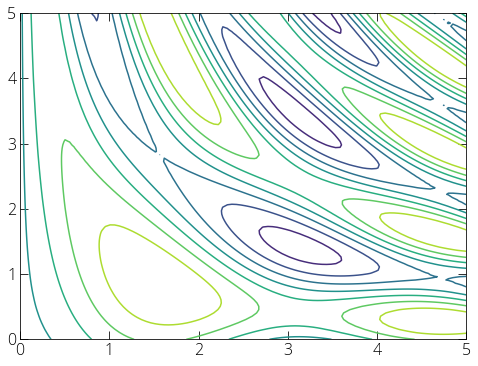
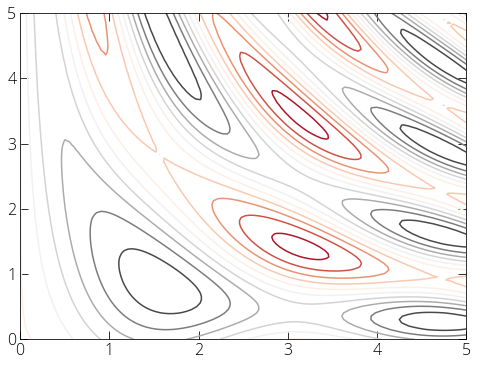
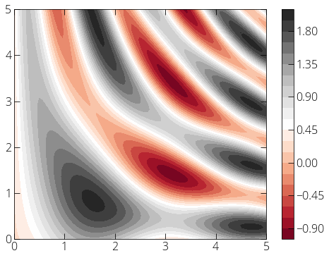

### Contour plot

```py
import numpy as np
import matplotlib.pyplot as plt 
%matplotlib inline
plt.rcParams["figure.figsize"] = (8, 6)

x = np.linspace(0, 5, 100)
y = np.linspace(0, 5, 100)
X,Y = np.meshgrid(x, y)

# Define some function 
Z = np.sin(X) ** 2 + np.cos(5 + X * Y)

plt.contour(X, Y, Z)
plt.show()
```

 

```py 
plt.contour(X, Y, Z, 10, cmap='RdGy')
plt.show()
```

 

```py 
plt.contourf(X, Y, Z, 20, cmap='RdGy')
plt.colorbar()
plt.show()
```

 
