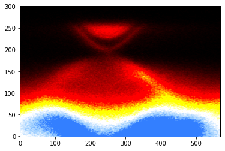

### Creating custom color map for matplotlib 

Matplotlib have several in-built color-maps. But in case you want to make one of your own. First we need to have rgb values of our color palette. You can use some artistic program like Photoshop, Gimp etc. to create your color palette, or you can just mathematically create a rgb table of your color palette. We need a rgb table. Here I have created a rgb table of 256 rows. I call the file [blue-hot.dat](https://github.com/pranabdas/python-learning/) (it's inside notebook folder). 

Here is our cmap generator function: 
```py 
def create_cmap(data_path):
    import numpy as np
    from matplotlib.colors import ListedColormap
    contents = open(data_path, "r").readlines()
    cmap_length = len(contents)
    cmap = np.ndarray((cmap_length, 4))

    for ii in range(cmap_length):
        cmap_row = contents[ii][:-1].split('\t')
        cmap[ii, 0] = cmap_row[0]
        cmap[ii, 1] = cmap_row[1]
        cmap[ii, 2] = cmap_row[2]
        cmap[ii, 3] = 1 # Default alpha
    cmap = ListedColormap(cmap)
    return cmap
``` 

Generate our blue-hot color map: 
```py 
blue_hot = create_cmap('blue-hot.dat')
```

Now we can use it in our matplotlib image plots. Let us get our 2-dimensional array of data as we did in our [image plot](image-plot.md) lesson. 
```py 
plt.imshow(spectra, aspect='auto', origin="lower", cmap=blue_hot, vmin=0, vmax=3000)
plt.show()
``` 

 

You can adjust *vmin* and *vmax* to set correct contrast while using any color map. 
