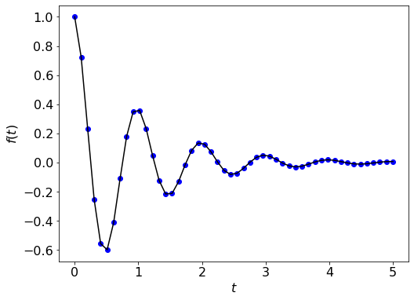

### Function plot 

We can plot functions in the following way: 
```py 
import matplotlib.pyplot as plt 
import numpy as np
%matplotlib inline

# define the function 
def f(t):
    return np.exp(-t) * np.cos(2*np.pi*t); 

t = np.linspace(0, 5, 50); 

plt.figure(figsize = (8, 6)); 
plt.rcParams.update({'font.size': 16}); 
plt.plot(t, f(t), 'bo', t, f(t), 'k'); 
plt.xlabel('$t$'); 
plt.ylabel('$f(t)$'); 
plt.show(); 
``` 

 
