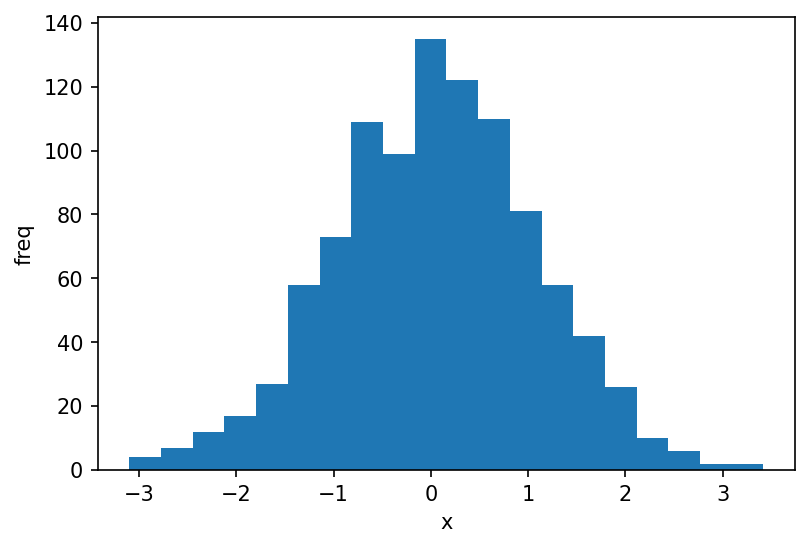

```python
import numpy as np
import matplotlib.pyplot as plt
%matplotlib inline
plt.rcParams["figure.dpi"]=150
plt.rcParams["figure.facecolor"]="white"

# generate 1000 random numbers from normal distribution
data = np.random.randn(1000)

plt.hist(data, 20)  # number of bins = 20
plt.xlabel('x')
plt.ylabel('freq')
plt.show()
```


