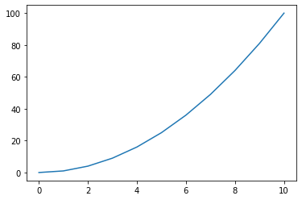
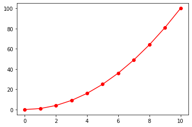
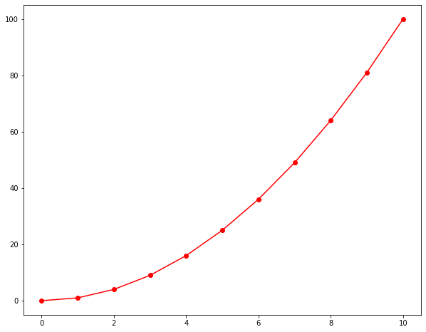
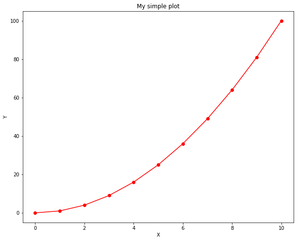
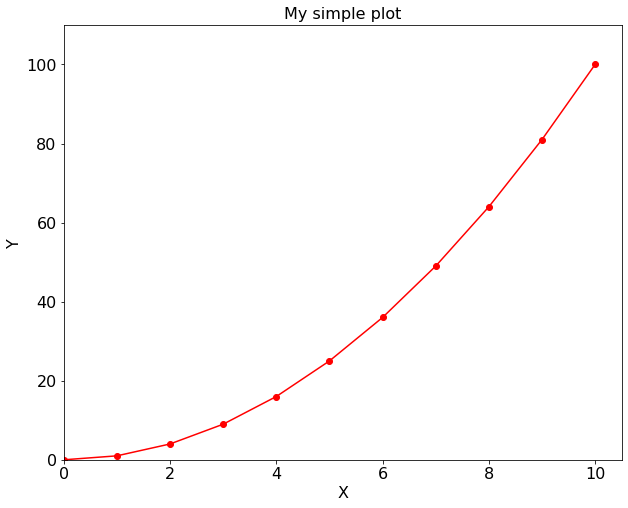
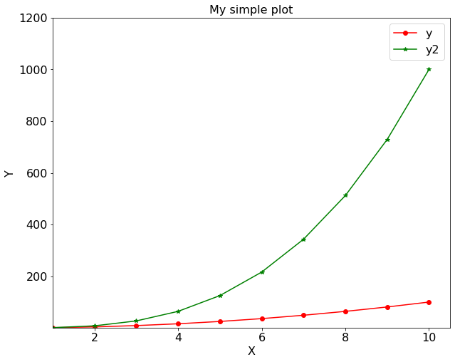

### Introduction to matplotlib 

*matplotlib* is a python graphical package to perform simple and advanced visual presentation. Let's dive into *matplotlib*. First task is to import the *matplotlib* into our program. We will also import *numpy* in order to do some numerical operations. 

```python 
import matplotlib.pyplot as plt 
import numpy as np 
# If you are using Jypyter notebook include the following line 
# to show the figure inline on the browser. 
%matplotlib inline 
```

Let's create two one dimensional array of data
```python
x = np.linspace(0, 10, 11);
y = x**2; 
```

Make a x vs. y plot: 
```python
plt.plot(x, y)
plt.show()
```

This produces following output:  


Now let's improve the figure a bit. The plt.plot accepts 3 basic arguments in the following order: (x, y, format). This format is a short hand combination of {color}{marker}{line}. 
```python
plt.plot(x, y, 'ro-')
plt.show()
```  


Looks like our figure size is too small, let's make it larger. 
```python
plt.figure(figsize = (10, 8))
plt.plot(x, y, 'ro-')
plt.show()
```


How about setting a title, x-, y-label to our figure: 
```python
plt.figure(figsize = (10, 8))
plt.plot(x, y, 'ro-')
plt.title('My simple plot')  
plt.xlabel('X')
plt.ylabel('Y')
plt.show()
``` 
 

Can you please increase the font size a bit? Sure: 
```python 
large = 22; med = 16; small = 12
params = {'axes.titlesize': large,
          'legend.fontsize': med,
          'figure.figsize': (16, 10),
          'axes.labelsize': med,
          'axes.titlesize': med,
          'xtick.labelsize': med,
          'ytick.labelsize': med,
          'figure.titlesize': large}
plt.rcParams.update(params)

plt.figure(figsize = (8, 6), dpi = 300)
plt.plot(x, y, 'ro-')
plt.title('My simple plot')  
plt.xlabel('X')
plt.ylabel('Y')
plt.xlim(0, 10.5)
plt.ylim(0, 110)
plt.show()
```
 

How can I append another plot on the same figure? 
```python 
y2 = x**3; 
plt.plot(x, y, 'ro-', label='y'); 
plt.plot(x, y2, 'g*-', label='y2'); 
plt.title('My simple plot'); 
plt.xlabel('X'); 
plt.ylabel('Y'); 
plt.legend(); 
plt.xlim(1, 10.5); 
plt.ylim(1, 1200); 
plt.show(); 
``` 
 

Notice that once we specify the *rcParams*, we do not need to specify again until we restart the kernel. You can go back to *matplotlib* defaults by: 
```python
plt.rcParams.update(rcParamsDefault)
``` 

Now visit <https://matplotlib.org> and explore yourself. 
