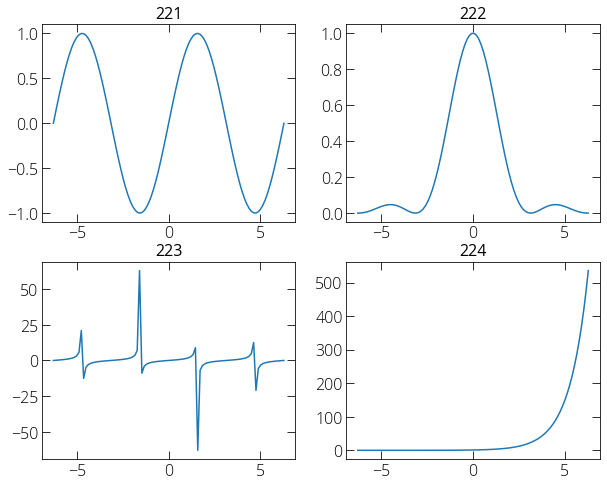

### Multiple panels or subplots

The following way we can incorporate multiple plots in a single graph window. 

```py
import matplotlib.pyplot as plt
import numpy as np 

x = np.linspace(-2*np.pi, 2*np.pi, 100)
y1 = np.sin(x)
y2 = (np.sin(x)/x)**2
y3 = np.tan(x)
y4 = np.exp(x)

plt.figure(figsize = (10, 8))

plt.subplot(221)  # plt.subplot(no_rows, no_cols, index)
plt.plot(x, y1)
plt.title('221')

plt.subplot(222)
plt.plot(x, y2)
plt.title('222')

plt.subplot(223)
plt.plot(x, y3)
plt.title('223')

plt.subplot(224)
plt.plot(x, y4)
plt.title('224')

plt.show()
```

 
