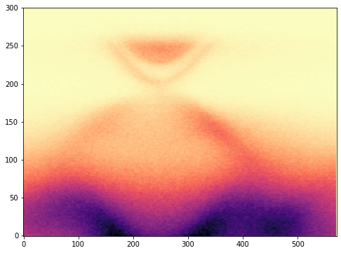

### Read data from web url

Like we can [read files](../introduction/file-read-write.md) from our local drive, we can also read data from a web url. Note that the url should point to the data file (e.g., *www.example.com/data.txt*) not the default *index.html* Here we try to read a text data file. 
```py 
import urllib
url = "https://data.mendeley.com/datasets/rfhhh54g9m/2/files/c3ef4285-ed19-447a-b7bf-effd94a62fbb/sample_spectrum.txt"
headers = {'User-Agent': 'Mozilla/5.0'}
req = urllib.request.Request(url = url, headers = headers)
data = urllib.request.urlopen(req).read().decode()
``` 

The data is read as a long string in the variable *data*. You have to know how the data is structured in order to use that data. In our case the data is a two dimensional spectrum image along with other information. I will extract only the spectrum image by using the following loader. 
```py 
def load_data(data) :
    import numpy as np 
    contents = data.splitlines()
    energy_length = contents[7] 
    start_string = contents[7].find("=") + 1 
    end_string = len(contents[7])
    energy_length = int(contents[7][start_string : end_string]) 

    angle_length = contents[10] 
    start_string = contents[10].find("=") + 1 
    end_string = len(contents[10])
    angle_length = int(contents[10][start_string : end_string]) 

    intensity = np.ndarray((energy_length, angle_length)) 

    for ii in range(energy_length):
        intensity_temp = contents[57 + ii]
        end_string = len(intensity_temp)
        intensity_temp = intensity_temp[1 : end_string] 

        start_string = 0
        for jj in range(angle_length + 1): 
            end_string = intensity_temp.find("  ", start_string)
            if jj == 0 : 
                energy[ii] = float(intensity_temp[start_string : end_string]) 
                start_string = end_string + 1
            elif jj > 0 :
                intensity[ii][jj - 1] = float(intensity_temp[start_string : end_string]) 
                start_string = end_string + 1
                
    return intensity 
```

Now load the data: 
```py 
>>> spectra = load_data(data)
``` 

The intensity is stored in a two-dimensional array. We can plot it to see: 
```py
import matplotlib.pyplot as plt 
%matplotlib inline
fig = plt.figure(figsize = (8, 6))
plt.imshow(spectra, aspect = 'auto')
plt.gca().invert_yaxis()
plt.set_cmap('magma_r') 
```

