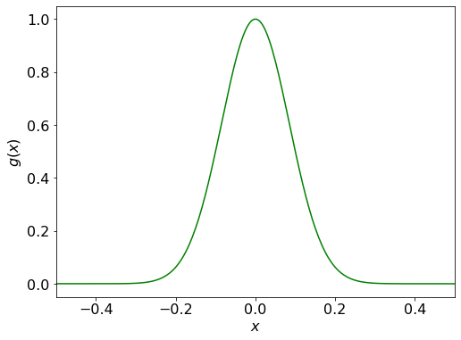
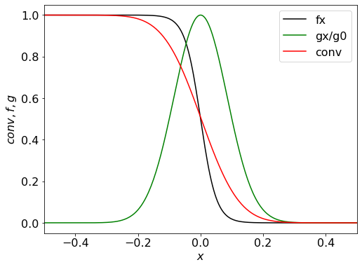

### Convolution 

```py 
from scipy import signal 
import numpy as np 
import matplotlib.pyplot as plt 
%matplotlib inline 

# define the first function, here Fermi-Dirac distribution  
def f(E, kT): 
    return 1/(np.exp(E/kT) + 1); 

kT = 0.025; # corresponding to room temperature 
E = np.linspace(-2, 2, 1000); 

plt.figure(figsize = (8, 6)); 
plt.rcParams.update({'font.size': 16}); 
plt.plot(E, f(E, kT), 'k'); 
plt.xlim(-0.5, 0.5); 
plt.xlabel('$E - \mu$'); 
plt.ylabel('$f(E, kT)$'); 
plt.show(); 
``` 
 

```py 
# Define normalized Gassian funtion 
def g(x, sigma):
    return (1/(sigma*np.sqrt(2*np.pi)))*np.exp(-x**2/(2*sigma*sigma)); 

x = np.linspace(-2, 2, 1000); 
sigma = 0.2/(2*np.sqrt(2*np.log(2))); # convert full width at half maxima 

plt.figure(figsize = (8, 6)); 
plt.rcParams.update({'font.size': 16}); 
plt.plot(x, g(x, fwhm), 'g'); 
plt.xlim(-0.5, 0.5); 
plt.xlabel('$x$'); 
plt.ylabel('$g(x)$'); 
plt.show(); 
``` 

 

```py 
fx = f(E, kT); 
gx = g(x, sigma); 
g0 = g(0, sigma); 
conv = signal.convolve(fx, gx, mode='same')/sum(gx); 

plt.figure(figsize = (8, 6)); 
plt.rcParams.update({'font.size': 16}); 
plt.plot(E, fx, 'k', label='fx'); 
plt.plot(x, gx/g0, 'g', label= 'gx/g0'); 
plt.plot(x, conv, 'r', label='conv'); 
plt.xlabel('$x$'); 
plt.ylabel('$conv, f, g$'); 
plt.xlim(-0.5, 0.5); 
plt.legend(); 
plt.show(); 
``` 

 

**Note:** Here we have created the functions in the x-range [-2, 2], and plotted in the x-range [-0.5, 0.5] in order to avoid the edges in during convolution. 
