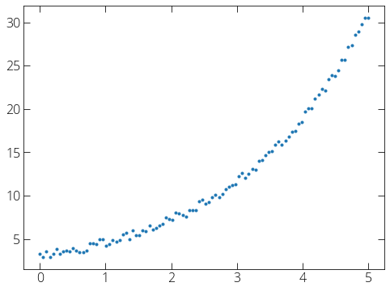
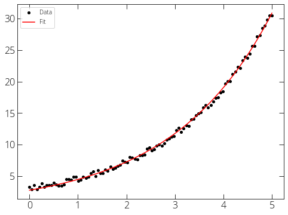

### Curve fitting 

```py
import numpy as np
import matplotlib.pyplot as plt
%matplotlib inline

# Generate our data 
x = np.linspace(0, 5, num=100)
y = 2.5 * np.exp(0.5 * x) + np.random.rand(100)

# plot our data 
plt.figure(figsize=(8, 6))
plt.plot(x, y, '.')
plt.show()
```



```py
from scipy import optimize

def fit_func(x, a, b):
    return a * np.exp(b * x)

params, params_covariance = optimize.curve_fit(fit_func, x, y, p0=[1, 1])

print(params)
```
[2.77004013 0.48224117]

```py
# plot both data and fit function 
plt.figure(figsize=(8, 6))
plt.plot(x, y, 'ok', markersize='4', label='Data')
plt.plot(x, fit_func(x, params[0], params[1]), c = 'r', label='Fit')
plt.legend()
plt.show()
```


